<div align="center">



<br/>

[](https://github.com/Dancan254?tab=followers)
[](https://www.youtube.com/@your_javaguy)
[](https://linkedin.com/in/ian-dancan-8a3721251)

</div>

---

<table>
<tr>
<td width="230" valign="top" align="center">


<br/><br/>

**Ian Dancan**
`@dancan254`

📍 Nairobi, Kenya
📧 dancanian25@gmail.com

</td>
<td valign="top">

```console
$ whoami
                            javaguy@nairobi
        (   (               ---------------
         )   )              Role: Backend Engineer / Java Instructor
        (   (               Community: Kenya JUG, Java Connect KE
      .___________.         Teaching: Java, Spring Boot, DSA, System Design
      |           |]        Frameworks: Spring Boot, Spring AI, Spring Security
      |  J A V A  |]        Messaging: RabbitMQ, Apache Kafka
      |___________|]        Infra: Docker, Kubernetes, Jenkins
       \_________/          Cloud: Azure, AWS
                            Data: PostgreSQL, Redis
                            Uptime: teaching since 2021
                            Motto: Learn Today. Teach Tomorrow.
```

</td>
</tr>
</table>

---

```console
$ cat ~/stack.md
Java             ████████████████████  teaching it
Spring Boot      ████████████████████  teaching it
RabbitMQ         ████████████████░░░░  teaching it right now
Spring Security  ███████████████░░░░░  shipped it
Docker           ███████████████░░░░░  shipped it
Apache Kafka     █████████████░░░░░░░  shipped it
Kubernetes       ████████████░░░░░░░░  shipped it
Spring AI        ███████████░░░░░░░░░  learning loudly
Go               ████░░░░░░░░░░░░░░░░  next up

# No bar here is a lie. "Learning loudly" means I teach it while I learn it —
# the notes become the video, the video becomes the repo.
```

---

## Start Here

```console
$ ls -1 ~/teaching
java-for-everyone/    # new to Java? start here
spring-rabbitmq/      # know Java, want messaging?
tripsaga/             # know Spring, want distributed systems?
```

| Path | What you get | |
|------|--------------|---|
| **📘 Java for Everyone** | The full Java roadmap — basics, OOP, Collections, File & Exception Handling, Streams, Lambdas. Start at the top, work down. | [](https://github.com/Dancan254/java-for-everyone) |
| **🐰 Spring RabbitMQ** | Production messaging with Spring Boot: exchanges, queues, retries, dead-letter queues, publisher confirms. Pairs with the video series running now. | [](https://github.com/Dancan254/spring-rabbitmq) |
| **🗺️ TripSaga** | Cloud-native travel platform. Spring Boot microservices, RabbitMQ, PostgreSQL — read the **Saga** and **Outbox** implementations for reliable distributed transactions. | [](https://github.com/Dancan254/tripsaga) |

---

## Latest

```console
$ tail -f ~/feed
```

<!-- FEED:START -->
<!-- Generated by scripts/update_feed.py — edits here are overwritten daily. -->

**▸ Latest from the channel**

- [RabbitMQ with Spring Boot: 9 Lessons in One Video](https://www.youtube.com/watch?v=FaLVkRKiD0I) · `2026-07-14`
- [Your First RabbitMQ Message](https://www.youtube.com/watch?v=Q_YNUBjc_cM) · `2026-07-09`
- [RabbitMQ Explained — Before You Write Any Java](https://www.youtube.com/watch?v=M4xTIZRJM8s) · `2026-07-02`

**▸ Latest writing**

- [“It Works” Is Where the Real Work Begins](https://yourjavaguy.substack.com/p/it-works-is-where-the-real-work-begins) · `Substack` · `2026-07-10`
- [Slow Down to Speed Up: A Calmer Way to Crack Technical Interviews](https://yourjavaguy.substack.com/p/slow-down-to-speed-up-a-calmer-way) · `Substack` · `2026-06-23`
- [I Finally Started Learning AWS. Here's What I've Learned So Far.](https://yourjavaguy.substack.com/p/i-finally-started-learning-aws-heres) · `Substack` · `2026-06-20`

<!-- FEED:END -->

---

## Community & Speaking

```console
$ systemctl status your_javaguy
● your_javaguy.service — Learn Today. Teach Tomorrow.
     Loaded: loaded (/etc/systemd/system/your_javaguy.service; enabled)
     Active: active (running) since 2021
   Main PID: 254 (teaching)
     Status: "Shipping backend systems. Teaching what I learn."
     Memory: unbounded (mostly Java)

     ├─ amigoscode.service              Java · Spring Boot · DSA · System Design
     ├─ kenya-java-user-group.service   co-organizer, one of Kenya's fastest-growing
     │                                  Java communities
     └─ java-connect-ke.service         organizer & speaker, East Africa's Java meetups

$ journalctl -u your_javaguy --since 2026 --grep=talk
2026  JavaConnectKE      Building AI Applications with Spring AI &
                         Retrieval-Augmented Generation (RAG)
2026  Strathmore Univ.   Jenkins Unchained: Multibranch Pipelines,
                         Parallel Stages & Notifications
```

---

## Activity

<div align="center">


</div>

---

## Connect

```console
$ curl -s https://github.com/Dancan254 | jq '.connect'
```

<div align="center">

[](https://www.youtube.com/@your_javaguy)
[](https://linkedin.com/in/ian-dancan-8a3721251)
[](https://yourjavaguy.substack.com)
[](https://medium.com/@dancanian25)
[](https://twitter.com/your_javaguy)
[](mailto:dancanian25@gmail.com)

<br/>

### Learn Today. Teach Tomorrow.

*Building software that scales. Sharing knowledge that lasts.*

</div>
