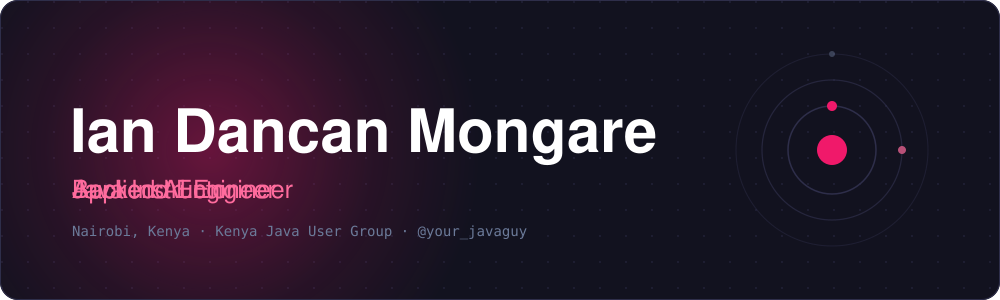

 

---

I build backend systems in Java and Spring, and AI features grounded in something checkable
rather than guessed. I teach the same things on YouTube and at Kenya's Java meetups.

Nairobi, Kenya. Currently at Amigoscode.

---

## Applied AI

#### [DevLens](https://github.com/Dancan254/devlens) — pull request analysis you can trust

Ask a language model to read a diff and it will confidently invent an endpoint that doesn't exist.
DevLens parses the Java source at both commits with JavaParser, works out what actually changed,
and hands the model those facts as ground truth it is told not to contradict. The prose can still
be wrong. The endpoint and entity lists cannot.

`Java 25` · `Spring Boot 4.1` · `Spring AI 2.0` · `pgvector` · `MCP`

#### [Spring AI RAG](https://github.com/Dancan254/spring-ai-rag) — RAG, measured at every step

Five stages, from naive retrieval to conversational RAG. Every stage runs against the same corpus
and the same questions through one evaluation harness, so each produces a number you can watch
move — rather than a tutorial that claims to be better than the last one.

`Java 25` · `Spring Boot 4.1` · `Spring AI 2.0` · `pgvector` · `Azure OpenAI`

---

## Backend

#### [log-guard](https://github.com/Dancan254/log-guard) — personal data never reaches the appender

A Spring Boot starter that masks personal data at the Logback event level, so console, file and
OTLP exports all see the same redacted output. Most redaction libraries rewrite the pattern
layout — that protects the console and nothing else.

`Java 25` · `Spring Boot 4.1` · `Logback` · `Log4j2` · `OpenTelemetry`

#### [Pitwall](https://github.com/Dancan254/pitwall) — high-throughput telemetry, measured

F1 telemetry from the car to the engineers' screens. 211,000 events per second into Kafka, where
the naive path manages 1,441. A twelve-million-row history query drops from 2,544 ms to 21 ms on a
continuous aggregate. Every figure measured, not estimated.

`Java 25` · `Spring Boot 4` · `Kafka` · `Protobuf` · `TimescaleDB` · `Grafana`

#### [TripSaga](https://github.com/Dancan254/tripsaga) — distributed transactions

A booking saga across flight, hotel and payment that settles `COMPLETED` or `COMPENSATED`, never
half-booked. There is no distributed `@Transactional` — RabbitMQ *is* the transaction.

`Java 25` · `Spring Boot 4` · `RabbitMQ` · `Outbox` · `PostgreSQL` · `Testcontainers`

---

## Teaching

#### [Java for Everyone](https://github.com/Dancan254/java-for-everyone) — new to Java? start here

A sequential curriculum — syntax, OOP, collections, streams and lambdas — with guides, code samples
and exercises. Start at the top and work down. The most-used thing I've written.

#### [Spring RabbitMQ](https://github.com/Dancan254/spring-rabbitmq) — messaging with Spring Boot

Nine lessons, from your first message to publisher confirms, manual acknowledgements and
dead-letter exchanges.

---

## Writing and video

I publish walkthroughs on YouTube and longer written pieces on Substack.

---

## Community and speaking

- **Amigoscode** — Java, Spring Boot, DSA, System Design
- **Kenya Java User Group** — co-organizer, teaching since 2023
- **Java Connect KE** — organizer and speaker, East Africa's Java meetups

Talks: *Building AI Applications with Spring AI and RAG* at JavaConnectKE, and *Jenkins Unchained*
at Strathmore University.

---

**Learn Today. Teach Tomorrow.**

